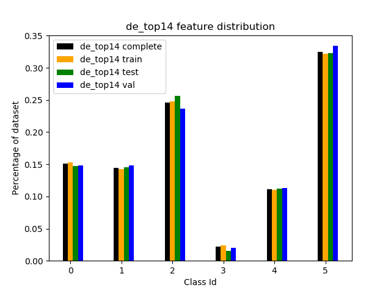
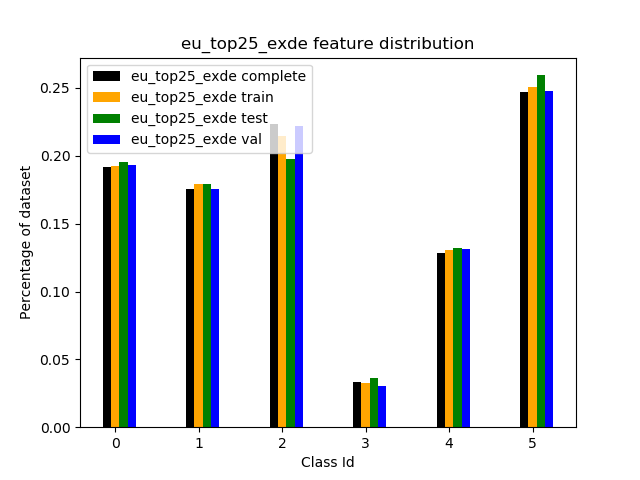
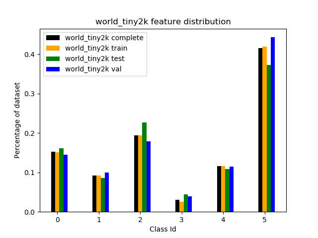

# Deeplab training

If the error ```error: Can't find libdevice directory ${CUDA_DIR}/nvvm/libdevice``` occurs:

Export the environment var *XLA_FLAGS* pointing to:

```--xla_gpu_cuda_data_dir=C:\Users\Fistus\miniconda3\envs\code\Library```

where this directory contains the path ```nvvm/libdevice``` (copied from cuda directory)!

Don't forget to restart Pycharm after creating the environment variable!

## Working params for train run on de_top15 with mobilenet

```
--logtostderr
--training_number_of_steps=90000
--train_split="train"
--model_variant="mobilenet_v2"
--output_stride=16
--decoder_output_stride=4
--train_crop_size=600
--train_crop_size=600
--train_batch_size=1
--initialize_last_layer=False
--last_layers_contain_logits_only=True
--train_batch_size=8
--dataset="de_top15"
--fine_tune_batch_norm=False
--train_logdir="K:/!!!!slurm trained models/test_train_mobilenet"
--dataset_dir="K:/FINAL_DATASETS/deeplab_de_top15_2"
--tf_initial_checkpoint="K:\!!!!slurm trained models\Pretrained weights\deeplab\deeplabv3_mnv2_cityscapes_train/model.ckpt"
```

# Datasets erzeugen

- 13 größte städte in dtl. (nach berlin, ist ja schon gedownloaded) hinzugefügt

- (y)Hamburg 		 		--- 663 sq km
- (y)Muenchen  			--- 1015 sq km    *neu
- (y)koeln                --- 615 sq km     *neu
- (y)Frankfurth am Main   --- 206 sq km
- (y)Stuttgart            --- 256 sq km
- (y)Düsseldorf           --- 292 sq km
- (y)Dortmund             --- 554 sq km
- (y)Essen                --- 173 sq km
- (y)Leipzig              --- 268 sq km
- (y)Bremen               --- 400 sq km
- (y)Dresden              --- 439 sq km
- (y)Hannover             --- 452 sq km
- (y)Nürnberg             --- 182 sq km

**Next**: Alle importieren in postgis
      Coordinaten der bbox Aufschreiben und in Python übernehmen (**DONE**)
	  
- (y)Hamburg 		 		--- 663 sq km
- (y)Muenchen  			--- 1015 sq km   
- (y)Koeln				--- 615 sq km   
- (y)Frankfurth am Main   --- 206 sq km
- (y)Stuttgart            --- 256 sq km
- (y)Duesseldorf          --- 292 sq km 
- (y)Dortmund             --- 554 sq km
- (y)Essen                --- 173 sq km
- (y)Leipzig              --- 268 sq km
- (y)Bremen               --- 400 sq km
- (y)Dresden              --- 439 sq km
- (y)Hannover             --- 452 sq km
- (y)Nürnberg             --- 182 sq km

**Next:** coords in python eintragen (**DONE**)

Downloadprozedur für neues dataset überlegen
Problem: Nur 25k images von google am Tag möglich
**Ein Image mit 600x600px 17 zoom hat circa 437x437 meter (0.43 sq km) 
in auf deutschem/europäischem Breitengrad**

Ausgerechnet mittels:

```
lat = 52.4983678856
lon = 13.3306850560
centerPoint = helper.G_LatLng(lat, lon)
corners = helper.getCorners(centerPoint, 17, 600, 600)
bbox = corners['W'], corners['S'], corners['E'], corners['N']
dis1 = helper.getMeterDistance(lon1=bbox[0], lat1=bbox[1], lon2=bbox[0], lat2=bbox[3])
dis2 = helper.getMeterDistance(lon1=bbox[0], lat1=bbox[1], lon2=bbox[2], lat2=bbox[1])
print(dis1)
print(dis2)
```

- Nicht mehr als 500 Bilder pro Stadt
- Dataset mit 7000 Bilden (incl. Berlin) erzeugt 'de_top14'
- Feature Distribution:

```
"building": 14.39
"road": 11.11
"unlabelled": 15.29
"water": 2.24
"residential": 32.44
"wood": 24.53
```

# Neues Dataset in Planung- Europa top 20 ex DE
1. Istanbul 8933 sq km y			*warning: 50% < unusable sea water*
2. Moskau 8846 sq km y
3. London 2286 sq km y
4. St. Petersburg 4212 sq km y
5. Madrid 	2749 sq km y
6. Kiew 	2340 sq km y
7. Rom     	1032 sq km y
8. Paris    1070 sq km y            *could not load bigger bbox 'too many nodes error from hotosm'*
9. Minsk    1464 sq km y
10. Wien    2079 sq km y
11. Bukarest 	1592 sq km y
12. Budapest   	1423 sq km y
13. Warschau    1445 sq km y
14. Barcelona   1350 sq km y
15. Charkiv     3240 sq km y
16. Mailand     2202 sq km y
17. Prag  	    1547 sq km y
18. Nischni Nowgorod 1092 sq km y
19. Sofia    	968 sq km y
20. Belgrad  	3579 sq km y
21. Kasan 	    1743 sq km y
22. Samara	    956 sq km y
23. Rostow am Don 	1309 sq km y
24. Birmingham  1588 sq km y
25. Ufa         888 sq km y

- Wichtig: Unterschiedliche viele Bilder von den Städten laden,
sodass Fläche optimal ausgenutzt wird

- *Problem:* Manche Städte haben sehr wenige gelabelte Gebäude (oft Viertel mit nur residential area ohne Gebäude)
- *Idee:* Bilde für jede Stadt Quotient aus Gebäude(Anzahl)/Qudratkilometer und lasse diesen Wert in die Wahl der zu ladenden
Gebäude für die Städte miteinfließen. Schließe ggf. zu schlechte Städte direkt aus

- *Big Todo*: Rolle keine zufälligen Kartenausschnitte mehr sondern zerhacke das Bild von links nach rechts und oben nach unten.
Dies könnte lange Wartezeiten beim Laden verursachen da oft große Gebiete mit unlabelt Data da sind. Schwierig ist die Implementierung
da die BBox des Bildes erst aus der Center-Coordinate errechnet werden muss und von vornherein nicht klar ist "wie weit" man nach rechts
bzw. nach unten gehen muss damit man das letzte Bild gerade nicht schneidet aber trotzdem nicht zuweit weg geht. Generische Lösung kompliziert
wegen Erdkrümmung.

*Außerdem auffällig:*
- Mehrspurige Autobahnen sind oft zu dünn
- Schräge Aufnahme von Gebäuden macht Labelling unpräzise
- Meersegmente problematisch, da sie ungelabellet sind (Wird vermutlich Wasserklassifikation stark schwächen wenn zuviel davon da ist)
- Manche Gebäude sind einfach blau angemalt (Google Feature? Geheimgebäude?)

| Stadt            | qm   | Gebäude    | Gebäude/qm   | Anzahl Bilder|
|------------------|------|------------|--------------|------------------:|
| Istanbul         | 8933 |   247320   |27.686|				1200
| Moskau           | 8846 |   472169   |53.376|				1800
| London           | 2286 |   400430   |175.16|             1000        
| St. Petersburg   | 4212 |   194267   |46.122|             1400
| Madrid           | 2749 |   181060   |65.863|             1000
| Kiew             | 2340 |   100724   |43.044|             700
| Rom              | 1032 |   156758   |151.89|              450
| Paris            | 1070 |   727437   |679.84|             1000
| Minsk            | 1464 |   113943   |77.82|               400
| Wien             | 2079 |   369930   |177.93|             800
| Bukarest         | 1592 |   89771    |56.388|              400
| Budapest         | 1423 |   205994   |144.76|              500
| Warschau         | 1445 |   238325   |164.93|              500
| Barcelona        | 1350 |   60619    |44.90|               250
| Charkiv          | 3240 |   126490   |37.871|             700
| Mailand          | 2202 |   224641   |102.01|             700
| Prag             | 1547 |   318561   |205.92|              500
| Nischni Nowgorod | 1092 |    85291   |78.105|              400
| Sofia            | 968  |    96911   |100.11|              380
| Belgrad          | 3579 |   205518   |57.423|             500
| Kasan            | 1743 |    71304   |40.908|              300
| Samara           | 956  |    35416   |37.046|              300
| Rostow am Don    | 1309 |   125197   |95.643|              400
| Birmingham       | 1588 |   600898   |378.39|             700
| Ufa              | 888  |    24986   |28.137|              200

Gesamt: 15580

Ermittlung günstiger Anzahl der Bilder pro Region (Grobe Abschätzungshilfe):
Für Städte mit mehr als 30 Gebäuden pro qm:

(*qm_nutzbar* / 0.5 qm ) * 0.3 

Für andere Städte :

(*qm_nutzbar* / 0.5 qm ) * 0.2

## Dataset Cleaning

Images which are to similiar to each other shall be removed (that is, from a given image pair *(im_1, im_2)*
with *dist(im_1,im_2)*<*Threshold*, *im_2* will be removed from the dataset).

With a **threshold of 0.0045**, this would affect the dataset as it follows:

- **de_top14**: Reduced from 7000 to 6562 **~6.26% images lost**
- **de_top25_exde**: Reduced from 16479 to 14601 **~11.4% images lost** 
- **world_tiny2k**: Reduced from 1999 to 1840 **~7.95% images lost**

# Feature Distrib on reduced Datasets






## Dataset Splitting 

The training and validation sets are used during training.

```
for each epoch
    for each training data instance
        propagate error through the network
        adjust the weights
        calculate the accuracy over training data
    for each validation data instance
        calculate the accuracy over the validation data
    if the threshold validation accuracy is met
        exit training
    else
        continue training
```

Once you're finished training, then you run against your testing set and verify that the accuracy is sufficient.

**Training Set**: this data set is used to adjust the weights on the neural network.

**Validation Set**: this data set is used to minimize overfitting.
 You're not adjusting the weights of the network with this data set,
 you're just verifying that any increase in accuracy over the training data set
 actually yields an increase in accuracy over a data set that has not been shown
 to the network before, or at least the network hasn't trained on it (i.e. validation data set).
 If the accuracy over the training data set increases, but the accuracy over then validation
 data set stays the same or decreases, then you're overfitting your neural network and you should stop training.

**Testing Set**: this data set is used only for testing the final solution in order to confirm
 the actual predictive power of the network.
 
# 5 Fold Validation

Different 5-Fold splits are checked and the most balanced ones chosen for 5-Fold-Cross-Validation

### de_top15

0: ['koel', 'dres', 'esse'] 
1: ['duis', 'stut', 'hann'] 
2: ['leip', 'muni', 'dort'] 
3: ['brem', 'berl', 'fran'] 
4: ['hamb', 'nuer', 'dues']

- [1408, 1401, 1414, 1405, 1404]
- Best fold splitting with std 4

### Feature distrib de_top15

e1: {'wood': 0.2983977884311869,
 'road': 0.10457110755997469, 
 'residential': 0.3067120837279039,
 'unlabelled': 0.1469938506155305,
 'building': 0.11831597024936884,
 'water': 0.02500919941603535}
 
e2:{'wood': 0.23019293956697626,
 'road': 0.1158905563486399,
 'residential': 0.3170478566896662,
 'unlabelled': 0.1600222242049327,
 'building': 0.15692133793322227,
 'water': 0.019925085256562777}


e3:{'wood': 0.29838557677196365,
 'road': 0.10811336240766953,
 'residential': 0.303818028052805,
 'unlabelled': 0.14888550997956929,
 'building': 0.11943965896589669,
 'water': 0.02135786382209649}


e4:{'wood': 0.20174671213918546,
 'road': 0.1149980525899564,
 'residential': 0.35344977856860416,
 'unlabelled': 0.1459538335310399,
 'building': 0.16415052985369719,
 'water': 0.019701093317516807}


e5:{'wood': 0.1725235022950302,
 'road': 0.11293436609686605,
 'residential': 0.3414093720322888,
 'unlabelled': 0.16904109488762292,
 'building': 0.16781921098448874,
 'water': 0.036272453703703696}

 
### eu_top25

0: ['berl', 'lond', 'mail', 'buka', 'kiew'] 
1: ['mosk', 'sama', 'rom_', 'sofi', 'kasa'] 
2: ['prag', 'wien', 'madr', 'muni', 'char'] 
3: ['pari', 'belg', 'barc', 'hamb', 'ista'] 
4: ['buda', 'nisc', 'wars', 'mins', 'st_p']

- [3053, 2954, 3036, 2917, 2941]
- fold splitting with std 54

### Feature distrib eu_top25

e1: {'residential': 0.303264278305492,
 'wood': 0.18885067420024038,
 'building': 0.1835410725333919,
 'unlabelled': 0.16669832314299232,
 'road': 0.12346273428685832,
 'water': 0.03418291753102592}
 
e2:{'residential': 0.28652251937109763,
 'wood': 0.1711001363499586,
 'building': 0.17061893665839142,
 'unlabelled': 0.2008524637027011,
 'road': 0.1376497959452343,
 'water': 0.033256147972617174}

e3:{'residential': 0.1989877680793447,
 'wood': 0.31977545747328323,
 'building': 0.16068834632557463,
 'unlabelled': 0.1750524493119603,
 'road': 0.12863185203484148,
 'water': 0.016864126774996345}

e4:{'residential': 0.2110840827714924,
 'wood': 0.25849840589646894,
 'building': 0.19598418561688194,
 'unlabelled': 0.18470212451910234,
 'road': 0.11392435912086225,
 'water': 0.03580684207519138}

e5:{'residential': 0.2490577921341947,
 'wood': 0.19677026143790854,
 'building': 0.16059237504250223,
 'unlabelled': 0.1990937436246172,
 'road': 0.14519783803694875,
 'water': 0.049287989723827856}

# Kaggle dataset

- train: 480, test: 60, val: 60
- distrib = {0: 0.615830, 1: 0.038690, 2: 0.004052, 3: 0.008817,
 			   4: 0.029346, 5: 0.108000, 6: 0.189018, 7: 0.005066,
 			   8: 0.001049, 9: 1.176852e-05, 10: 0.000120}
* median frequency balancing:
* 0: 0.014317
* 1: 0.227888
* 3: 2.175962
* 4: 1.000000
* 5: 0.300450
* 6: 0.081639
* 7: 0.046646
* 8: 1.740426
* 9: 8.405148
* 10: 749.202109
* 11: 73.475000}

# Vaihingen dataset 

- train: 264, test: 15, val: 15


* vaihingen weights
* {0: 0.27496586356764924, 1: 0.2600085789871505, 2: 0.20469702380952381, 3: 0.23992597316704442, 4: 0.012058994708994705, 5: 0.008343565759637187}

* median frequency balancing:
* 0: 0.808506
* 1: 0.855016
* 2: 1.086051
* 3: 0.926584
* 4: 18.435326
* 5: 26.644663


