# Trainlog - Chronologisch

## Training mit dem PSPModel

- **Start Slurm Run: 18.05.2018 morgens**
- trainiert mit 1600 (600x600)Images über 10000 Iterations (<3h mit 1080Ti von LS6) von Scratch
- [SLURM_OUT_LOG_1](../train_logs_slurm/slurm_psp_10000_its_first_test.out)
-  pretrained mit cityscaped, Gewichte geladen wie oben
-  leider sehr schlechte Ergebnisse, benutzt: poly lr policy mit base_lr: 1e-3 und power=0.9
-  Ergebnisse loss schwankt im mittleren-oberen 2.000 - Bereich
- TODO: Ging er überhaupt runter später? Ja aber nur minimal und extrem langsam.
- PLOTTEN!!Dann schauen ob LR Policy geändert werden sollte

____
- Neuer Trainingsrun gestartet (**Start Slurm Run: 18.05.2018**) mit 1600 (600x600)Images über 100000 Iterations (~35h mit 1080Ti von LS6)

Ist leider nicht komplett durchgelaufen. Letzter gespeicherter Checkpoint bei 77400.
**Wie verhindert man das? Wieso kommt überhaupt OutOfMemory hier?**

- [SLURM_OUT_LOG_2](../train_logs_slurm/PSPNet/slurm_psp_100000_sec_test.out)

```
step 77394 /t loss = 2.040, (1.130 sec/step)
step 77395 /t loss = 2.332, (1.092 sec/step)
step 77396 /t loss = 2.172, (1.098 sec/step)
step 77397 /t loss = 2.116, (1.138 sec/step)
step 77398 /t loss = 2.087, (1.109 sec/step)
step 77399 /t loss = 2.272, (1.130 sec/step)
The checkpoint has been created.
```

**Zur Frage:** Ging er überhaupt runter später? Threshold? PLOTTEN!!

**Antwort:** Er ging runter, wenn auch sehr langsam.
Die LR-Policy, die verwendet wurde sieht man hier

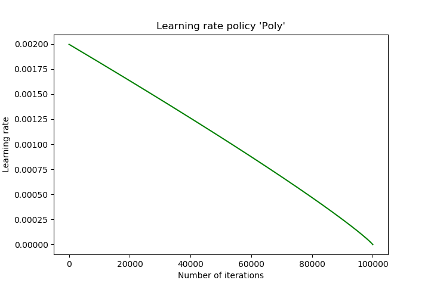

Hier ist die Learning-Curve vom ersten run mit 10000 iterations (~12.5 epochs, wegen batchsize=2)

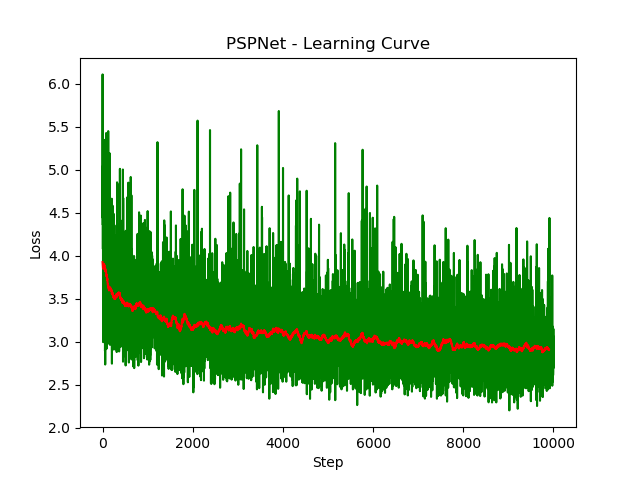

Hier der Plot vom Training mit 100000 images (wieder von scratch).
Parameter waren bei beiden runs gleich:

```
LEARNING_RATE = 1e-3
MOMENTUM = 0.9
POWER = 0.9 #für lr-policy 'poly' ->siehe caffe
WEIGHT_DECAY = 0.0001
```

Zu Beachten ist, dass die Anzahl der images sehr klein war (1600) und kein Pretraining
und kein Class-Weighting vorgenommen wurde

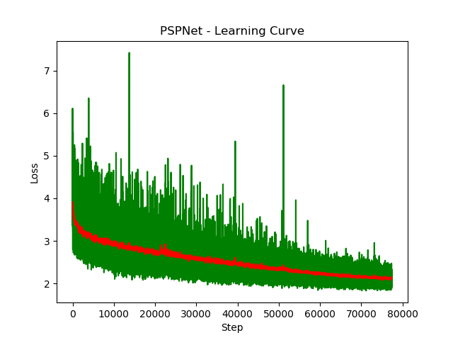

**Neue Strategie** (letzter Versuch auf dem kleinen Dataset, 1600 Images):

- Zwei Trainruns **on scratch**: Zuerst 10.000 Iterationen (~ 6.25 Epochs) bei dem running-mean und beta_gamma variablen trainiert werden

- **Start Slurm Run: 23.05.2018**, Dauer ~4h

- [Slurm-Log-N1](../train_logs_slurm/PSPNet/slurm_psp_10000_its_first_test.out)

Verwendeter Aufruf-Code für slurm:

```

sbatch -p dmir --gres=gpu:1 run2.sh -e /scratch/tensorflow/venv_base 
-s ./master/code/Segmentation_Models/PSPNet/osm_train.py 
-r master/code/requirements.txt 
-p ./master/code/Segmentation_Models/PSPNet/ 
-a  --restore-from="./master" --update-mean-var --train-beta-gamma --not-restore-last
# not restore last ist hier eigentlich nicht nötig, da eh kein Model restored wird
```

Ergebnis nach erstem Run:

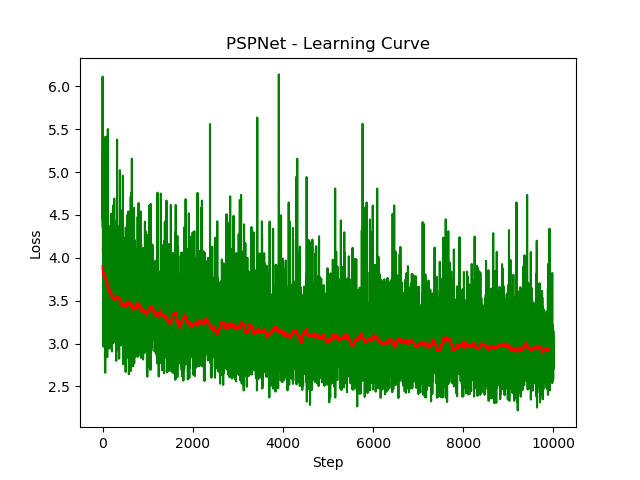

____
- Dann ein weiterer Trainingsrun (vorheriges Model wird restored) mit 150.000 Iterations (94! ~ Epochs) ohne running_mean 

- **Start Slurm Run: 24.05.2018**
- [Slurm-Log-N2](lol)

Verwendeter Aufruf-Code für slurm:

```

sbatch -p dmir --gres=gpu:1 run2.sh -e /scratch/tensorflow/venv_base 
-s ./master/code/Segmentation_Models/PSPNet/osm_train.py 
-r master/code/requirements.txt 
-p ./master/code/Segmentation_Models/PSPNet/ 
-a  --restore-from="./master/code/Segmentation_Models/PSPNet/mean_trained_model" --train-beta-gamma
```

Ergebnis nach zweitem Run:

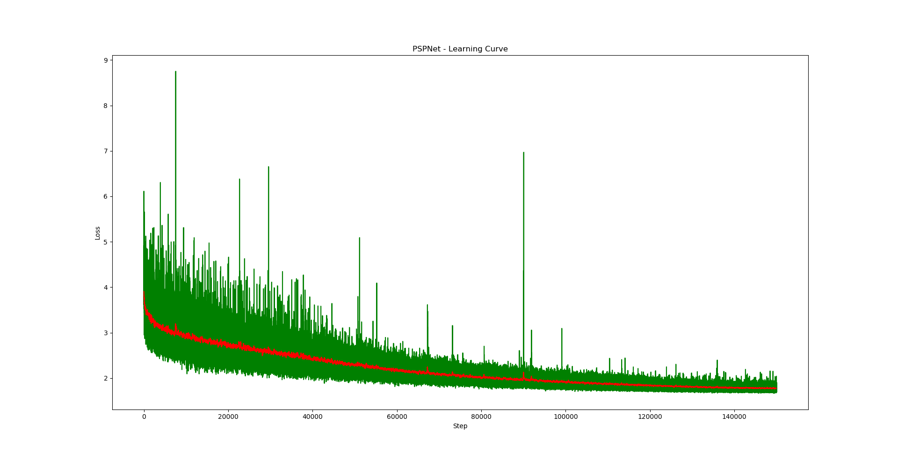

## Training mit dem ICNet Model

- **Start Slurm Run: 27.05.2018** Runtime ~ 1h
- Kleiner Run mit 2000 Iterationen auf 16 batch-size auf kleinem Datensazu (1600 Images) um Vergleich mit PSPNet-Model zu bekommen
- Es wurde das pretrained cityscaped Modell dafür genommen und auf osm-finetuned
- Dies soll der erste Run sein, danach ohne running-mean für längeren Zeitraum trainieren

Verwendeter Aufruf-Code für slurm:

```
sbatch -p dmir --gres=gpu:1 run2.sh -e /scratch/tensorflow/venv_base
-s ./master/code/Segmentation_Models/ICNet/train.py 
-r master/code/requirements.txt 
-p ./master/code/Segmentation_Models/ICNet 
-a --update-mean-var --train-beta-gamma --not-restore-last
```

- Wesentlich bessere Ergebnisse schon noch kürzerer Zeit

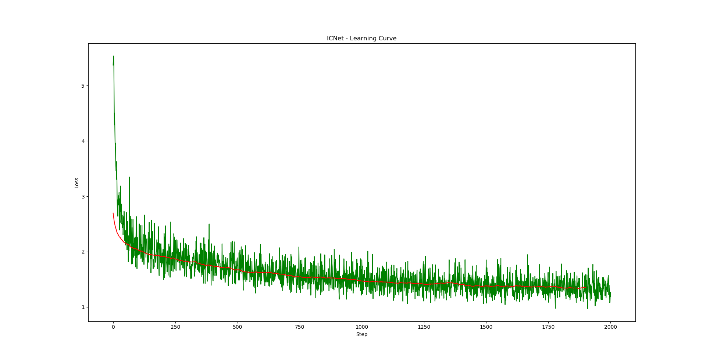

Jetzt soll ein neuer Run gestartet werden bei dem das vorherige Model restored und die Running-Mean aktualisierung ausgeschaltet wird.
Dabei wird über 25000 Iterationen trainiert. Batchsize bleibt 16.

Verwendeter Aufruf-Code für slurm:

```
sbatch -p dmir --gres=gpu:1 run2.sh -e /scratch/tensorflow/venv_base
-s ./master/code/Segmentation_Models/ICNet/train.py 
-r master/code/requirements.txt 
-p ./master/code/Segmentation_Models/ICNet 
-a --train-beta-gamma 
```

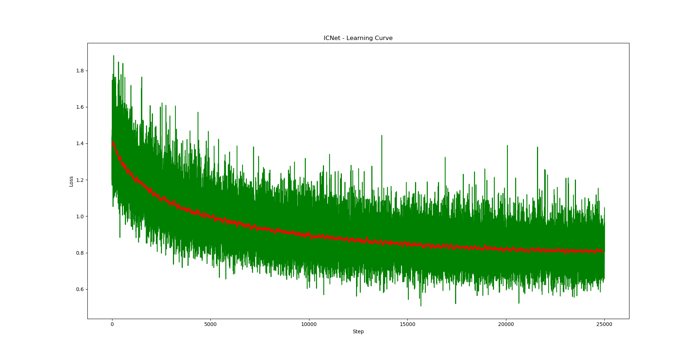

**Sample inference:**


- Evaluation on 1000 images of de_top14 dataset = **0.282 IoU**
- Dominating yellow and black colors at inference 
- Poor road & building detection, TODO: **Use bigger dataset & mitigate class imbalance using weighted class in loss function**
- Note, that only a tiny dataset (train of *world_tiny_2k* = 1600 imgs) has been trained for too long (250 epochs =(*num_it* * *batch_size* /1600))
- Next Step: **Use Bigger Dataset** or **Use Weighted Classes in Loss Function**

____
### Use Weighted Classes in Loss Function
- Modified loss function to

```
def create_loss(output, label, num_classes, ignore_label):
    raw_pred = tf.reshape(output, [-1, num_classes])
    label = prepare_label(label, tf.stack(output.get_shape()[1:3]), num_classes=num_classes, one_hot=False)
    label = tf.reshape(label, [-1,])

    indices = get_mask(label, num_classes, ignore_label)
    gt = tf.cast(tf.gather(label, indices), tf.int32)
    pred = tf.gather(raw_pred, indices)

    # added class weights  un, bui, wo, wa, ro, res
    class_weights = tf.constant([0.153, 0.144, 0.245, 0.022, 0.11, 0.325])
    weights = tf.gather(class_weights, gt)

    loss = tf.losses.sparse_softmax_cross_entropy(logits=pred, labels=gt, weights=weights)
    reduced_loss = tf.reduce_mean(loss)

    return reduced_loss
```

- Then, trained 20800 Iterations, (*batch_size* = 16), loading stored model of ICNet (trained on *world_tiny_2k* dataset)
- Evaluation on 1000 images of de_top14 dataset = **0.395 IoU** **Nice Improvement!**


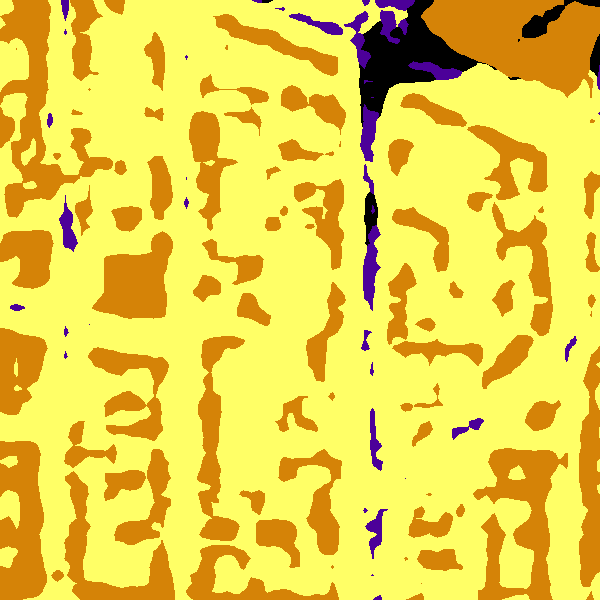
___
### Train on dataset *de_top14*

Applying weights had a very positive effect on the prediction considering the high amount of wrong predicted residential area in the former training sessions.
Now, the model is trained on a much bigger dataset, whose train split consists of 80% of 7000 images of the biggest german cities regarding the number of inhabitants.
At first a short train session of 2000 iterations (*batch_size*=16, *epochs*~6) is used to train all weights including both running-mean and variance and beta and gamma variables.

- **Start Slurm Run: 3.06.2018 ** ~1h
- used pretrained weights from smaller dataset
- *base_lr*=0.001


Used slurm call:

```
sbatch -p dmir --gres=gpu:1 run2.sh -e /scratch/tensorflow/venv_base
 -s ./master/code/Segmentation_Models/ICNet/train.py
 -r master/code/requirements.txt
 -n True -i "icnet_2k_mean_and_betagamma_nolastlayer"
 -p ./master/code/Segmentation_Models/ICNet
 -a --num-steps=2000 --update-mean-var
 --train-beta-gamma
 --not-restore-last
```

For the main training session the resulting weights are restored completely (including last layer) and trained again
of the same dataset for 150000 iterations (*batch_size*=16, *epochs*~428).

- **Start Slurm Run: 3.06.2018 ** ~ 30h 
- used all pretrained weights ICNet from earlier run on 3.06.2018 
- *base_lr*=0.001

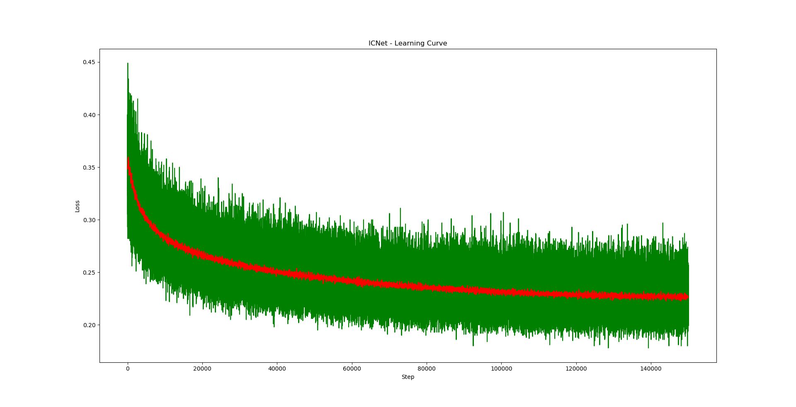
Used slurm call:

```
sbatch -p dmir --gres=gpu:1 run2.sh -e /scratch/tensorflow/venv_base
 -s ./master/code/Segmentation_Models/ICNet/train.py
 -r master/code/requirements.txt
 -n True -i "icnet_150k_betagamma_withlayer"
 -p ./master/code/Segmentation_Models/ICNet
 -a --num-steps=150001
 --train-beta-gamma
```

- Evaluation on train set = **0.18892 mIoU** 
- Evaluation on 0.1*7000 images of de_top14 dataset (test_set) = **0.1875 mIoU**


Again, way too much residential area has been classified.
Since this it has been used a differend dataset in this run, than in the run the model has been restored from, the weights will probably have to be adjusted to the new class distribution.

**Update:** 
Apparently, even in the first proper ICNet run (IoU 0.395) on dataset *world_tiny_2k* the wrong weights obtained from the class distribution of
dataset *de_top14* have mistakenly been used. Note, that the amount of residential area labels is lower in *world_tiny_2k* than in *de_top14*.
As in this run the network model tends do predict cities completely as residential areas, the weights (especially the one which belongs to residential area) might have to be set 
to more imbalanced values to take account for the class distribution in the new dataset.


Feature Distrib
```
# world_tiny_2k
{"building": 8.68, " road": 11.31, "unlabelled": 29.56, "water": 1.03, "residential": 27.16, "wood": 22.27}
# de_top14
{"building": 14.39, "road": 11.11, "unlabelled": 15.29, "water": 2.24, "residential": 32.44, "wood": 24.53}
# eu_top25_exde
{"building": 17.58, "road": 12.85, "unlabelled": 19.30, "water": 3.31, "residential": 24.71, "wood": 22.25}
```

# Inverse Weights

Im *de_top14* dataset also die folgenden Gewichte
Now an approach is tested which uses weights set inverted to the frequency of the class (Alex Dallmann)
In the *de_top14* dataset the following weights are applied:
```
    # added class weights         un,   bui,     wo,    wa,    ro,   res
    class_weights = tf.constant([6.540, 6.949, 4.077, 44.643, 9.001, 3.083])
```

Using this weights a new run is started:

- *de_top14* dataset
- use weights from 2k run
- train only beta_gamma (no mean)
- 150k iterations
- **Start Slurm Run: 5.06.2018 18:00Uhr ** PENDING
- used all pretrained weights ICNet from earlier 2k run on 3.06.2018 
- *base_lr*=0.001
- 150k iterations


Used slurm call:

```
sbatch -p dmir --gres=gpu:1 run2.sh -e /scratch/tensorflow/venv_base
 -s ./master/code/Segmentation_Models/ICNet/train.py
 -r master/code/requirements.txt
 -n True -i "icnet_150k_de_top14_betagamma_withlayer_invers_weights"
 -p ./master/code/Segmentation_Models/ICNet
 -a --num-steps=150001
 --train-beta-gamma
```

- Evaluation on train set = **0.032 mIoU** 
- Evaluation on 0.1*7000 images of de_top14 dataset (test_set) = **0.030 mIoU**
- *Conclusion:* Inverted Weights are really bad :D
- Images tend to contain only *unlabelled* and *building* labels and completely ommit water and road 


## Concerning weights ...

The Segnet paper says:


*When  there  is  large  variation  in  the  number  of
pixels in each class in the training set (e.g road, sky and building
pixels dominate the CamVid dataset) then there is a need to weight
the loss differently based on the true class. This is termed class balancing. We use
median frequency balancing [13] where the
weight assigned to a class in the loss function is the ratio of the
median of class frequencies computed on the entire training set
divided by the class frequency. This implies that larger classes in
the training set have a weight smaller than 1
and the weights of the smallest classes are the highest. We also experimented
with training the different variants without class balancing or equivalently using
natural frequency balancing.*

- **Median frequency balancing:** https://stats.stackexchange.com/a/288354
[13] Eigen,Fergus, 2015, "Predicting depth, surface normals and semantic labels with a common multi-scale convolutional architecture" [paper](https://arxiv.org/pdf/1411.4734.pdf)

- [code ex stackexchange](https://stats.stackexchange.com/questions/284265/understanding-median-frequency-balancing)
- [python gist class weights](https://gist.github.com/christian-rauch/45aabbd31a62e7cf382c69d33878d0c0)
- [repo link to class_weights.py](../class_weights.py)

**Calculated Weights for median frequency balancing for de_top14 dataset**:

```
class probability:
0: 0.151513
1: 0.144133
2: 0.245657
3: 0.022395
4: 0.111255
5: 0.325046

median frequency balancing:
0: 0.975644
1: 1.025603
2: 0.601745
3: 6.600600
4: 1.328684
5: 0.454776
```

Now, this weights will be used for another train run on the *de_top14* dataset:

- **Slurm run Start 7.06.2018 18:30**
- load 2k pretrained model of ICNet
- 150k iterations
- bad results, loss does not decrease further after threshold at ~ 70k iterations
- *run cancelled* at about 115k its as no improvement could be detected

IC model at its    | test(700) mIoU| train(5000) IoU
74750 iterations   |  0.2239       | 0.2230
113450 iterations  |  0.2156       | 0.2146

___

Next, a new run using the same class weights is applied.
This time both, running mean and variance and beta-gamma vars are trained during all iterations.


- **Slurm run Start 8.06.2018 18:30** ~
- load 2k pretrained model of ICNet
- 150k iterations
- batchsize = 16
- train *running-mean-var* and *beta-gamma vars*
- Evaluation on train set = **0.2738 mIoU** 
- Evaluation on test set (700 images) = **0.2744 mIoU** 

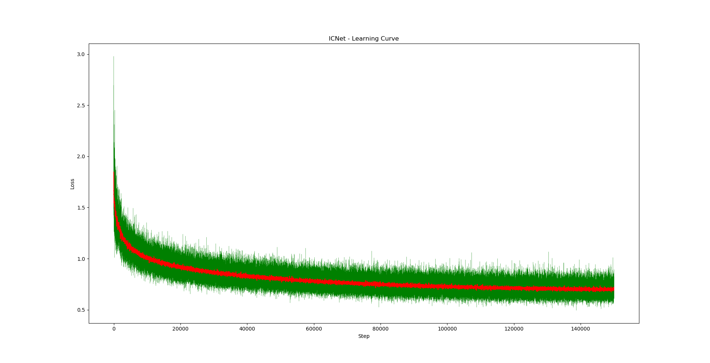
**TODO show results**

## Training of SegNet Model
A Segnet model has been modified to be trained with osm data using *de_top14* dataset.
[Here](https://github.com/mathildor/TF-SegNet) is a modified Segnet which has been used
for segmentation of aerial images. *TODO:* Try it out and compare results, but I guess it has just been
just for detecting buildings and therefore won't reach a signifantly higher acc, as the complexity increases
dramatically with the presence of roads, residential area etc.

## SegNet from scratch RUN 1

- **Slurm run Start 9.06.2018 18:30**
- *de_top14* dataset
- Lr=0.001 (AdamOptimizer)
- batchsize = 5
- Iterations = 20000 (~16 epochs)
- Evaluation on test set (700 images) = **acc: 0.393, mIoU: 0.269**

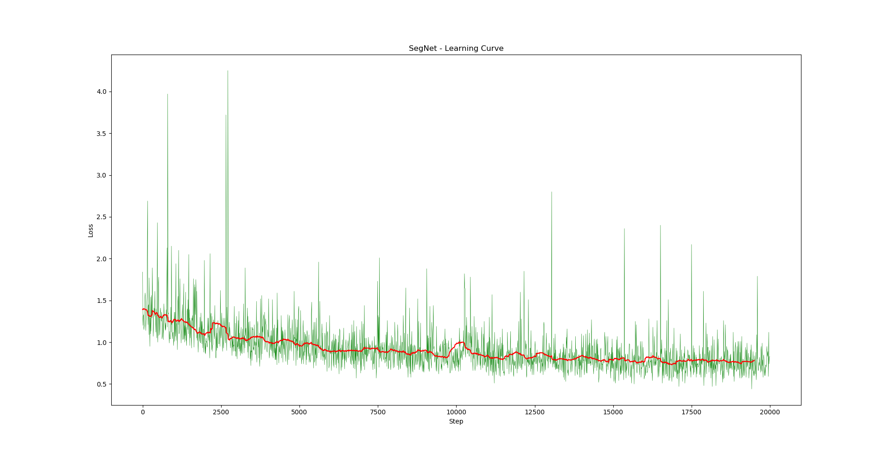

- [TrainLog SegNet](../train_logs_slurm/SegNet/slurm_segnet_20k_detop14_lr=0,001.out)(mit IoU per Class)

###Sample from SegNet Run 1


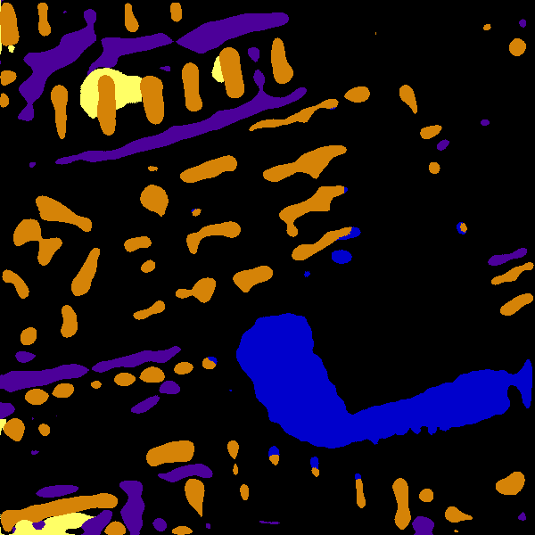
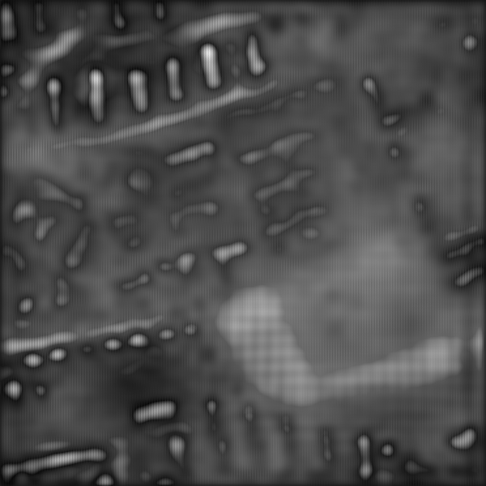

- *next:* maybe finetuning using lower lr?
____

## SegNet RUN 1_1

- **Slurm run Start 10.06.2018 18:00**
- *de_top14* dataset
- Lr=0.0001 (AdamOptimizer)
- finetuning using prestored model (from 9.06.18 trained 20k iterations from scratch)
- batchsize = 5
- Iterations = 150000 
- Evaluation on train set (5000 images) = **acc: 0.6739, mIoU: 0.5311** **New Highscore for SegNet**
- Evaluation on test set (700 images) = **acc: 0.6698, mIoU: 0.5211** **New Highscore for SegNet**


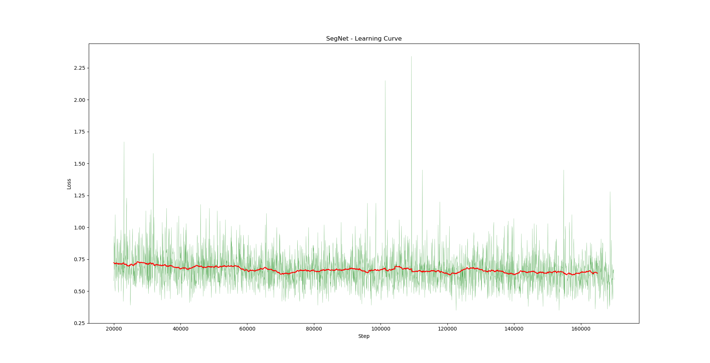

- [TrainLog SegNet](../train_logs_slurm/SegNet/segnet_detop14_150k,lr0,001_ft_from20k.out)(mit IoU per Class)


Loss does not seem to decrease significantly but the results are much better (considering IoU-Metric).

###Sample from SegNet Run 1_1


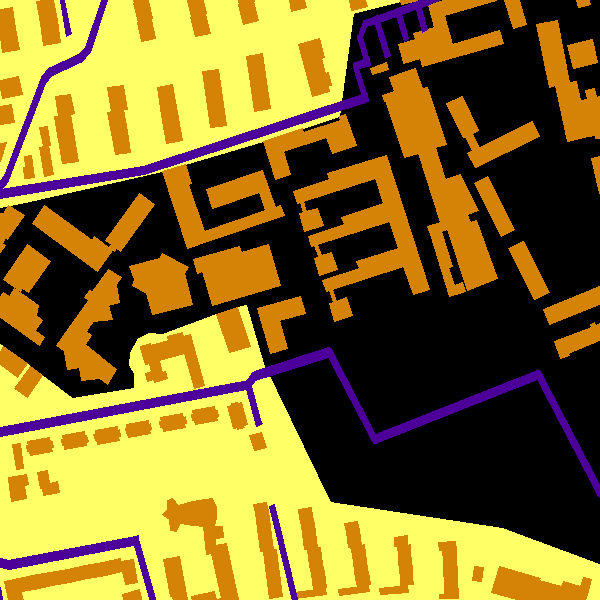
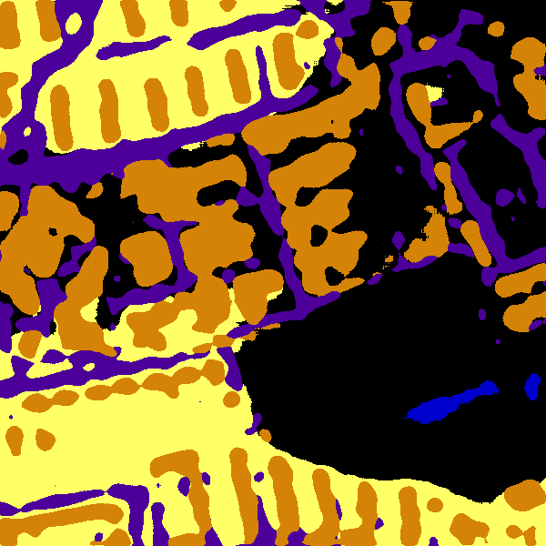
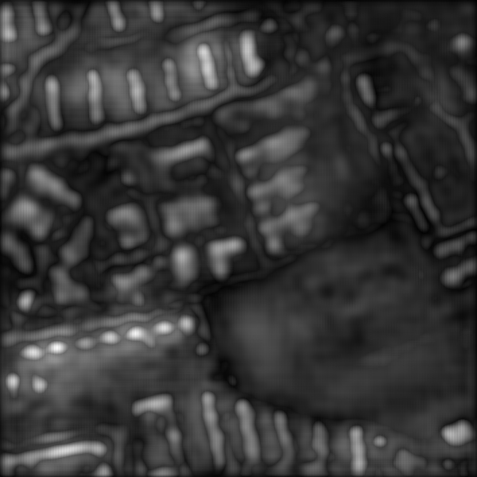

____

## ICNET from cityscapes Run 1

- **RUN 1** **Slurm run Start 15.06.2018 2:00**
- *de_top14* dataset
- train from **icnet_cityscapes_trainval_90k_bnnomerge**
- Lr=0.001 (Momentum Optimizer)
- batchsize = 16
- Iterations = 5000
- train **beta_gamma var** and **running mean and variance**
- Evaluation on train set (5000 images) = **mIoU: 0.5569**
- Evaluation on test set (700 images) = **mIoU: 0.5284**
- **Next run planned:** Finetune with **lr=0.0001**, train only **beta_gamma**

sbatch call:

```
sbatch -p dmir --gres=gpu:1 run2.sh -e /scratch/tensorflow/venv_base\
 -s ./master/code/Segmentation_Models/ICNet/train.py\
 -r master/code/requirements.txt\
 -n True -i "icnet_detop14,5k,betagamma,meanvar,scratch"\
 -p ./master/code/Segmentation_Models/ICNet\
 -a "--num-steps=5000 --save-pred-every=1000 --learning-rate=0.001\
 --train-beta-gamma --snapshot-dir=./master/code/Segmentation_Models/ICNet/icnet_scratch_detop14_5k_beta_meanvar_lr0,001\
 --update-mean-var"
```

###Sample from ICNet Run 1

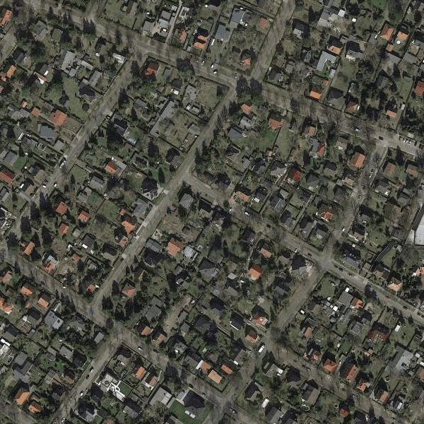

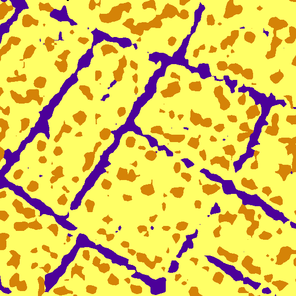
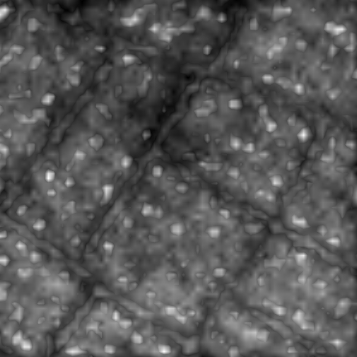

___
## ICNET from cityscapes 1_1

- **RUN 1_1** **Slurm run Start 15.06.2018 2:00**
- *de_top14* dataset
- train from **ICNET from cityscapes 1/2**
- Lr=0.0001 (Momentum Optimizer)
- batchsize = 16  
- Iterations = 500000 (cancelled by slurm finished at 440k)  
- train **beta_gamma var** 
- Evaluation on train set (5000 images) = ** mIoU: 0.3307**
- Evaluation on test set (700 images) = ** mIoU: 0.3176**

###Sample from ICNet Run 1_1

**Accuracy decreased dramatically! Drop from 0.5284 to 0.3176!**

**Results are achieved only with labelling residential area!**


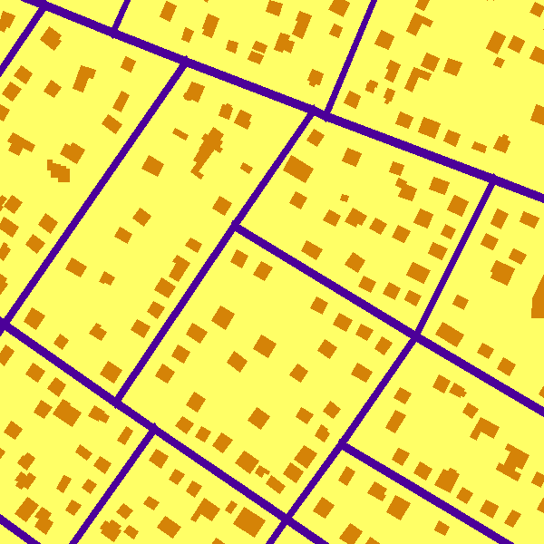
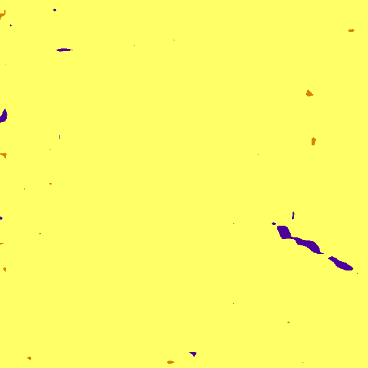
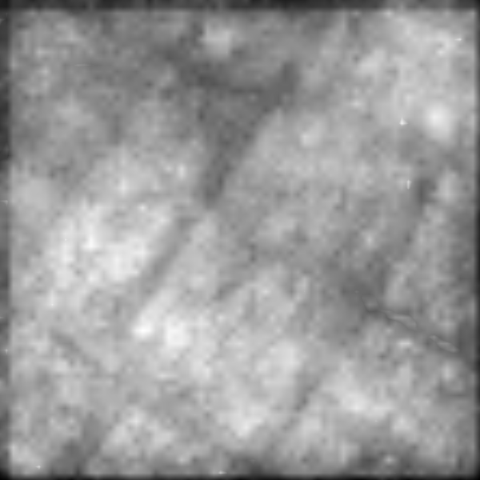

___
## ICNET from cityscapes 1_2

- Question: What went wrong with ICNET run 1_1?
- Try to train while updating mean and var from the bn layer and check if the results are better!
- Keep all other parameters the same (Changed batchsize to 18)!
- Answer: Bad results from run 1_1 are caused by inactive bn-Layers! Train them always!

- **RUN 1_2** **Slurm run Start 24.06.2018 16:00** **Finished: 1.07.2018 12:50**
- *de_top14* dataset (**cleaned**)
- train from **ICNET from cityscapes 1**
- Lr=0.0001 (Momentum Optimizer)
- batchsize = 18  
- Iterations = 420000  
- train **beta_gamma var** 
- train **mean_variance_var** 
- **Evaluation on train set** (5250 images) = ** mIoU: 0.5736** **New Highscore for ICNet**
- **Evaluation on test set** (656 images) = ** mIoU: 0.5561** **New Highscore for ICNet**


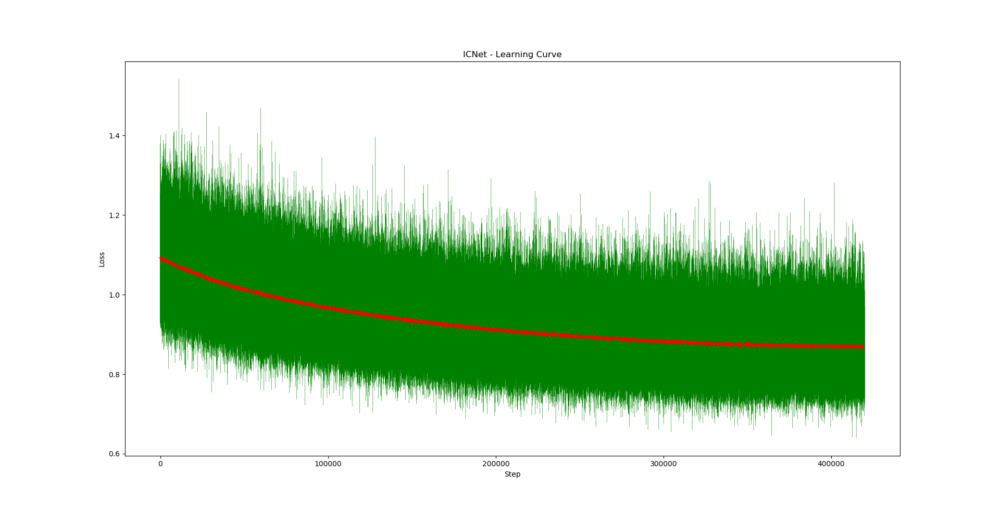

- [TrainLog ICNet](../train_logs_slurm/ICNet/slurm_icnet_420k_detop14_bn_bg.out)

###Sample from ICNet Run 1_2

- mIoU Accuracy **increased and reached a new highscore value**, -> **Training BN-Layer is crucial**

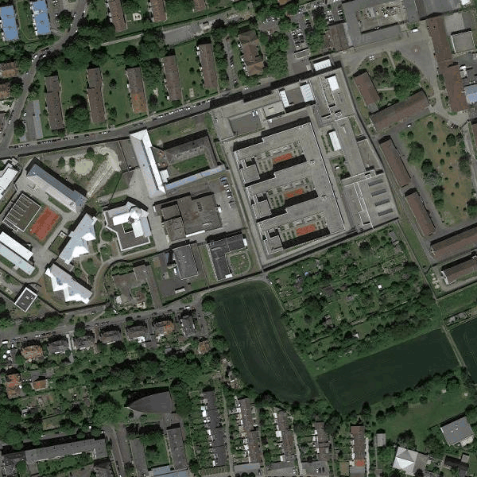

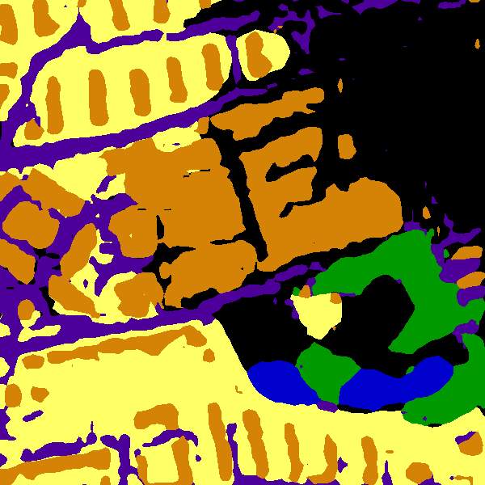
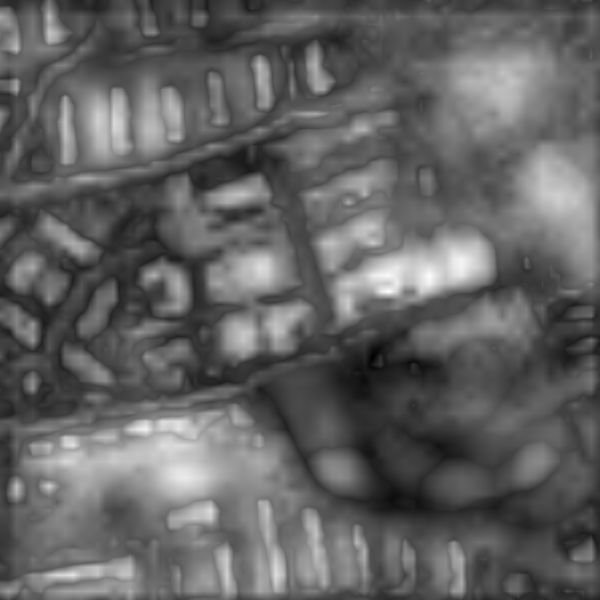
___

## SegNet RUN 1_1_1 Finetune with **eu_top25_exde**
- The previous model has been trained solely on german data. How well can this learnt knowledge 
be generalized on other european cities? Does finetuning on the european data weaken the accuracy on
german groundtruth predictions? Let's find it out!

- **Slurm run Start 24.06.2018 17:00 Finished: 28.06.2018 12:00**
- *eu_top25* dataset (**cleaned**)
- Lr=0.0001 (AdamOptimizer)
- finetuning using prestored model **Segnet Run 1_1** (from 10.06.18)
- batchsize = 5
- Iterations = 300000 
- Evaluation on train set (11681 images) = **acc: ?, mIoU: ?**
- Evaluation on eu test set (1460 images) = **acc: 0.578, mIoU: 0.4354**
- Evaluation on de test set (656 images) = **acc: 0.656, mIoU: 0.4744**


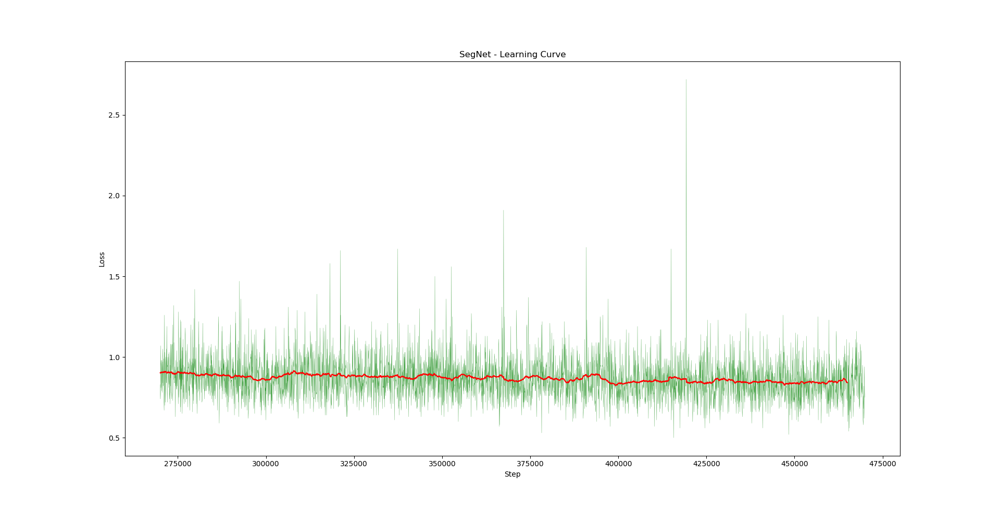

- [TrainLog SegNet](../train_logs_slurm/SegNet/segnet_finetune_eu.out)


###Sample from SegNet Run 1_1_1


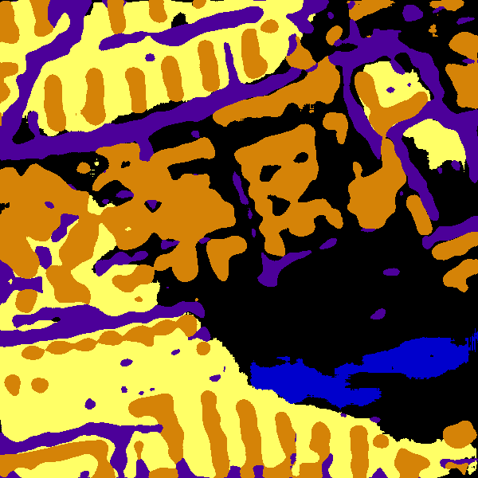
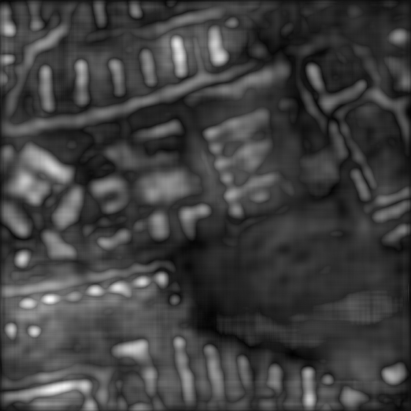
____


## ICNet RUN 1_2_1 Finetune with **eu_top25_exde** 
- The previous model has been trained solely on german data. How well can this learnt knowledge 
be generalized on other european cities? Does finetuning on the european data weaken the accuracy on
german groundtruth predictions? In Segnet we could not improve our original performance when generalizing on european data.
Is this because of the data or the model? Find it out by finetuning the best ICNet model on european data dataset **eu_top25_exde**

**PLANNED**

- **Slurm run Start: ? Finished: ? ***
- *eu_top25* dataset (**cleaned**)
- Lr=0.0001 (AdamOptimizer)
- finetuning using prestored model **ICNet Run 1_2** (from 24.06.18)
- batchsize = 18
- Iterations = ? 
- Evaluation on train set (11681 images) = **mIoU: ?**
- Evaluation on eu test set (1460 images) = **mIoU: ?,**
- Evaluation on de test set (656 images) = **mIoU: ?,**


- [TrainLog ICNet TODO](../train_logs_slurm/ICNet/todo)

###Sample from ICNet Run 1_2_1


____


## DeeplabV3+ RUN 1 on **de_top14**
- Train the latest powerful **deeplab** model on osm data and check the results.


**PLANNED**
